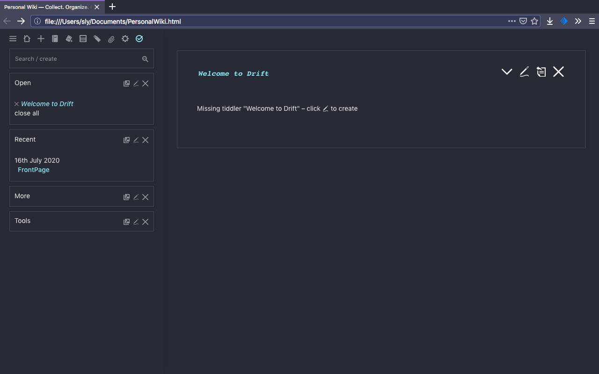

# Dracula for [TiddlyWiki](https://tiddlywiki.com/)

> A dark theme for [TiddlyWiki](https://tiddlywiki.com/).

## Install

All instructions can be found at [draculatheme.com/tiddlywiki](https://draculatheme.com/tiddlywiki).

## Team

This theme is maintained by the following person(s) and a bunch of [awesome contributors](https://github.com/dracula/tiddlywiki/graphs/contributors).

 |
--- |
[Sly Bouhafs](https://github.com/slybouhafs)

## License

[MIT License](./LICENSE)
